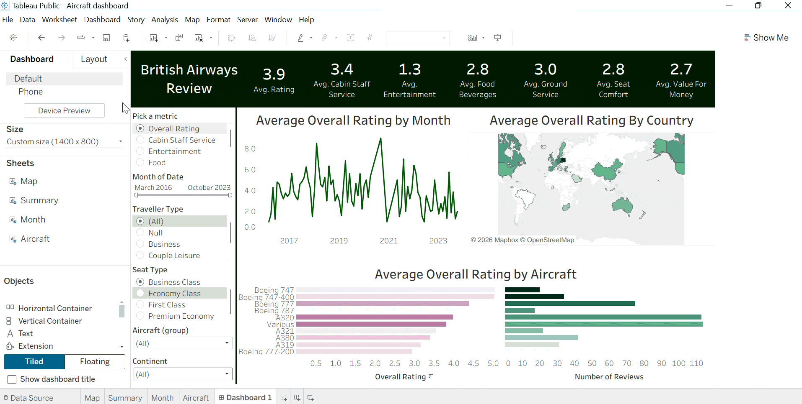

# British Airways Customer Review Dashboard | Tableau

An interactive Tableau dashboard analyzing 1,300+ British Airways customer reviews to surface how service quality varies by country, month, and aircraft type — built with parameters, calculated fields, and dynamic filtering.

**[View Live Dashboard on Tableau Public →](https://public.tableau.com/app/profile/amna.soomro/viz/Aircraftdashboard_17868621706500/Dashboard1)**

## What it does

Reviewers rate British Airways on 7 separate metrics (overall rating, cabin staff service, food, seat comfort, entertainment, ground service, value for money). Instead of building 7 separate dashboards, this project uses a **parameter-driven calculated field** so a single set of visuals can display any metric the user picks — no rebuilding required.

### Key features

- **Dynamic metric switching** — a "Pick a metric" parameter feeds a calculated field (`Metric Selected`) that swaps the underlying measure via a CASE statement, letting one chart set answer 7 different questions
- **Geographic breakdown** — a world map showing average score by reviewer's country
- **Trend analysis** — a line chart tracking the average metric month over month
- **Aircraft comparison** — a dual bar chart comparing average scores across aircraft types (A320, A380, Boeing 777, etc.)
- **Cross-filtering** — filters for continent, seat type (Economy/Business/First), traveller type, aircraft group, and date range, all wired to update the full dashboard at once

## Demo

*Switching the metric parameter updates the map, trend line, and bar chart simultaneously.*

## Tools used

`Tableau Desktop` · `Data blending (CSV join)` · `Parameters` · `Calculated Fields` · `Geographic mapping`

## Data

- `ba_reviews.csv` — British Airways customer reviews (rating, aircraft, route, traveller type, seat class, and 7 sub-metrics per review)
- `Countries.csv` — country-to-continent/region reference table, joined in to enable continent-level filtering

## Files in this repo

| File | Description |
|---|---|
| `Aircraft_dashboard.twb` | Tableau workbook — open in Tableau Desktop/Public |
| `data/ba_reviews.csv` | Review-level dataset |
| `data/Countries.csv` | Country reference table for the map |

## How to view

1. Download [Tableau Public](https://www.tableau.com/products/public) (free)
2. Open `Aircraft_dashboard.twb`
3. Use the "Pick a metric" parameter in the top-right of the dashboard to explore different service dimensions

---
*Part of my data analytics portfolio — built to practice parameter-driven dashboard design and geographic visualization in Tableau.*
